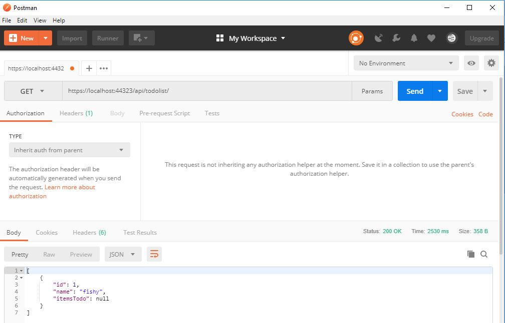

#Link to deployed site 
https://todolistappprogram.azurewebsites.net/

1. Name 
#Lab 17 API Double Resources

2. One-Liner
This is an API with CRUD capabilities that can take items and list them.

3. Usage
a. First install appropriate programs. Refer to Step 5 in this README.
b. Upon start up, the user will be shown a "Hello World". This looks deceiving but read on to step c.
c. To reach any of the functionality, they will use Postman to check CRUD (create, read, update, delete) operations. The C is for create. The option to create is under the tab 'Post'.
d. To Update, the option to update is under the tab 'Put'.
e. To Read, the option to update is under the tab, 'Get'.
f. To Delete, the option to delete is under the tab, 'Delete'.

Visual

4. API
This is a custom API, which lists items.

5. Installation
Install Visual Studio 2017 and .NET Core SDK. Have Microsoft Azure account for deployment. Postman for usability.

6. License
This program's License is MIT.

7. Acknowledgements - I worked with 
- http://github.com/jcqnly 
- Jesse Atay, my life partner
- Mario Nishio